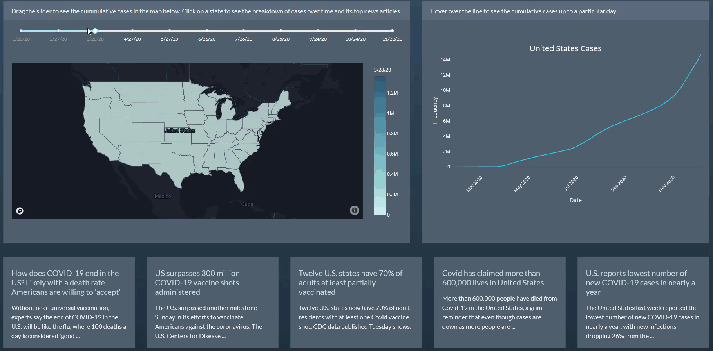

# Covid-19 Dashboard

### Pre-Requirements
Dependencies can be easily installed by running the command:
pip install -r requirements.txt

### How to run
This app can be ran locally by executing the command:
'python app.py'

### Description
This is an analytic web application with interactive graphs that demonstrate the development of Covid-19 cases in the United States.
The data includes cases by state for the time frame January 28, 2020 to November 23,2020.

